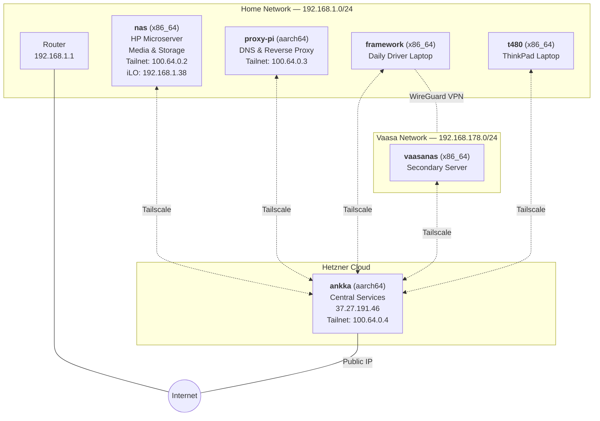
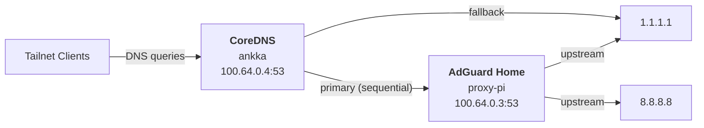
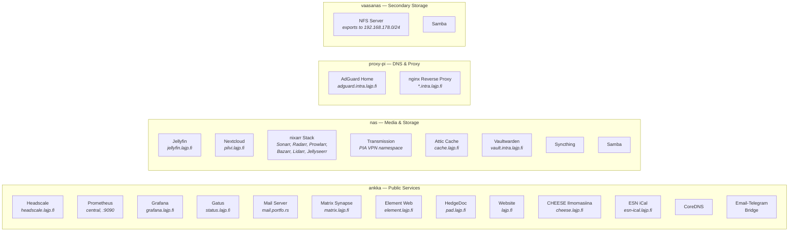
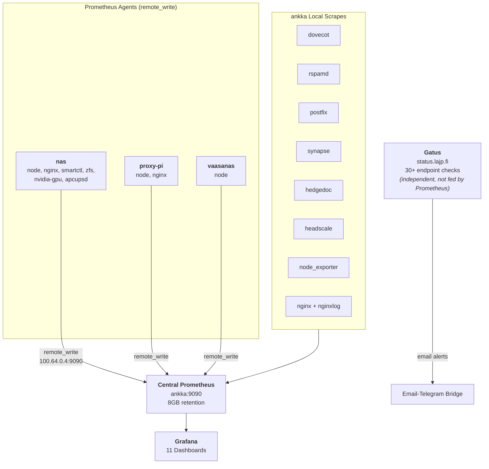
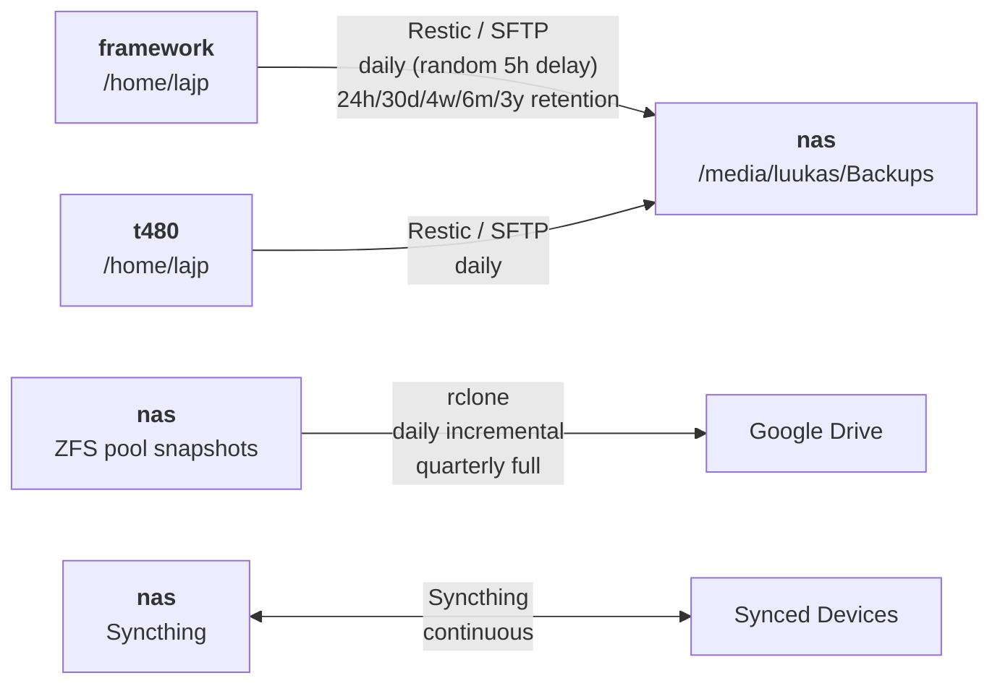

# Infrastructure Overview

6 NixOS hosts across 3 physical locations, connected via a self-hosted Headscale/Tailscale mesh VPN.

## Host Topology

### Host Roles

| Host | Location | Arch | Type | Key Role |
|------|----------|------|------|----------|
| **ankka** | Hetzner (Helsinki) | aarch64 | Server | Central control plane: Prometheus, Grafana, Headscale, mail, Matrix, HedgeDoc, Gatus, CoreDNS, website |
| **nas** | Home | x86_64 | Server | HP Microserver (iLO at .38): Jellyfin, nixarr stack, Nextcloud, Syncthing, Samba, Attic cache, ZFS, NVIDIA GPU, UPS |
| **proxy-pi** | Home | aarch64 | Server | Network edge: AdGuard Home DNS, nginx reverse proxy for internal services |
| **vaasanas** | Vaasa | x86_64 | Server | Secondary storage: NFS server, Samba, ZFS |
| **framework** | Mobile | x86_64 | Desktop | Daily driver: Framework 13 AMD, Niri compositor, multiple VPNs, Docker |
| **t480** | Mobile | x86_64 | Desktop | Secondary laptop: ThinkPad T480, Niri compositor, PIA VPN |

## DNS Resolution

- Headscale configures `100.64.0.4` (CoreDNS on ankka) as the nameserver for the tailnet.
- **CoreDNS** receives all tailnet DNS queries and forwards them sequentially: first to AdGuard Home, falling back to 1.1.1.1 if unreachable.
- **AdGuard Home** (proxy-pi) provides ad-blocking and filtering, forwarding to upstream resolvers.

## Service Map

## Monitoring Architecture

### Grafana Dashboards

| Dashboard | Metrics Source |
|-----------|---------------|
| nixos-nodes | node_exporter (all hosts) |
| nginx | nginx exporter |
| nginx-analytics | nginx-log exporter (JSON logs) |
| email | dovecot, rspamd, postfix |
| gpu | nvidia-gpu exporter (nas) |
| smart | smartctl exporter (nas) |
| zfs | zfs exporter (nas) |
| ups | apcupsd exporter (nas) |
| headscale | headscale metrics (ankka) |
| hedgedoc | hedgedoc metrics (ankka) |
| synapse | matrix synapse metrics (ankka) |

## Backup Strategy

- **Restic** backs up `/home/lajp` from desktops to nas via SFTP. Excludes `.cache`, databases, and large repos.
- **ZFS backup** sends incremental snapshots to Google Drive via rclone. Uses ZFS holds to track state.
- **Syncthing** provides continuous file sync on nas.
- **backup-notify** sets a failure wallpaper if restic backup fails (enabled on framework).

## Domains & Certificates

### Public Domains (ankka — ACME/Let's Encrypt)

| Domain | Service |
|--------|---------|
| `lajp.fi` | Website + Matrix .well-known delegation |
| `headscale.lajp.fi` | Headscale VPN control |
| `grafana.lajp.fi` | Grafana dashboards |
| `status.lajp.fi` | Gatus status page |
| `pad.lajp.fi` | HedgeDoc collaborative notes |
| `matrix.lajp.fi` | Matrix Synapse homeserver |
| `element.lajp.fi` | Element Web client |
| `cheese.lajp.fi` | Cheese ilmomasiina |
| `esn-ical.lajp.fi` | ESN calendar service |
| `luuk.as` | Placeholder page |

### Public Domains (nas — DynDNS + ACME)

| Domain | Service |
|--------|---------|
| `jellyfin.lajp.fi` | Jellyfin media server |
| `jellyseerr.lajp.fi` | Jellyseerr request interface |
| `pilvi.lajp.fi` | Nextcloud |
| `cache.lajp.fi` | Attic binary cache |

### DynDNS Only (vaasanas)

| Domain | Service |
|--------|---------|
| `mc.portfo.rs` | DynDNS record (no nginx) |

### Internal Domains (proxy-pi — Cloudflare DNS wildcard cert)

| Domain | Proxied To |
|--------|-----------|
| `adguard.intra.lajp.fi` | AdGuard Home (localhost) |
| `ilo.intra.lajp.fi` | iLO on nas (192.168.1.38) |
| `router.intra.lajp.fi` | Router (192.168.1.1) |
| `vault.intra.lajp.fi` | Vaultwarden (192.168.1.35:8222) |

## Mail Server

FQDN: `mail.portfo.rs` (ankka). Uses simple-nixos-mailserver with rspamd spam filtering.

| Domain | Purpose |
|--------|---------|
| `lajp.fi` | Primary personal |
| `portfo.rs` | Family |
| `formicer.com` | Organization |
| `nextcloud.otanix.fi` | Service notifications |
| `oy.lajp.fi` | Business |

Accounts: one main account on lajp.fi, plus send-only accounts for alerts (monitored by email-telegram bridge), nextcloud notifications, and no-reply.

## Network Segments

| Segment | CIDR | Hosts | Notes |
|---------|------|-------|-------|
| Home LAN | 192.168.1.0/24 | nas, proxy-pi, framework, t480 | Router at .1, nas iLO at .38, Vaultwarden at .35 |
| Vaasa LAN | 192.168.178.0/24 | vaasanas | Accessible from framework via WireGuard |
| Tailnet | 100.64.0.0/10 | All hosts | Managed by Headscale on ankka |
| Hetzner Public | 37.27.191.46/32 | ankka | Public-facing services |
